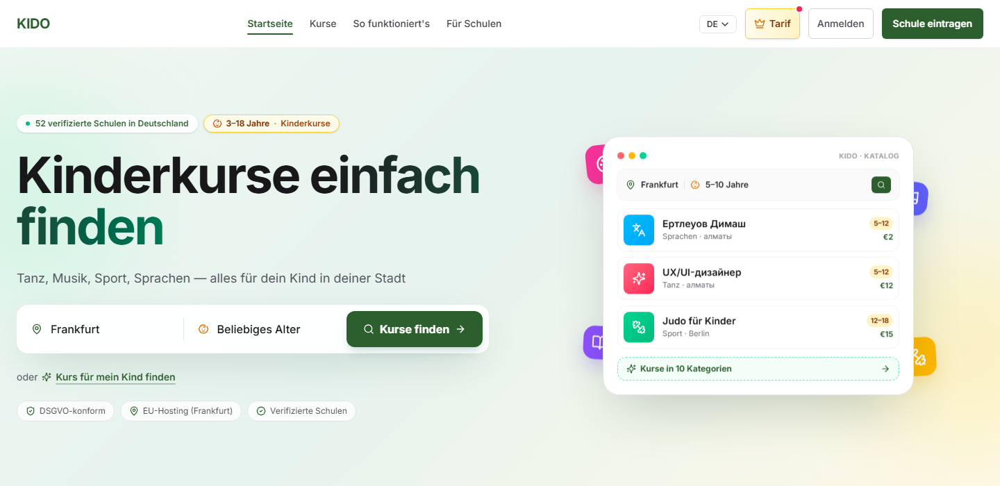

# KIDO — Kinderkurse einfach finden

**Live (DE): https://kido-six.vercel.app**

A DSGVO-first marketplace for children's courses in Germany. Parents search verified schools by city, age and category — sport, music, dance, languages, robotics and more, ages 3–18 — book a trial lesson and pay online. Schools get their own cabinet: listings, bookings, course statistics.

## Award

**ISM Startup Competition 2025 — Special Prize «Gutmann Global Advisory Partner»** for the KIDO concept: an advisory package worth €10,000. International School of Management, Cologne, 30 October 2025 — Emina Anuarbekova and Dameli Aidar.

## Team

- **Emina Anuarbekova** — [@Emina-An](https://github.com/Emina-An) — product lead
- **Alexander Kurchakov** — [@Alexanderadon](https://github.com/Alexanderadon) — design & development

## Product

- Catalogue of verified schools with search by city, age and 10 categories
- Trial lessons and online booking, Stripe payments
- School cabinet: courses, bookings, statistics; Founder pricing for early schools
- DSGVO-compliant, EU hosting (Frankfurt)
- Stack: React Router 7 (SSR) · Supabase (RLS) · Tailwind v4 · Feature-Sliced Design · Stripe Connect

## Status

Beta. The application source is private; this repository is the public product page.
